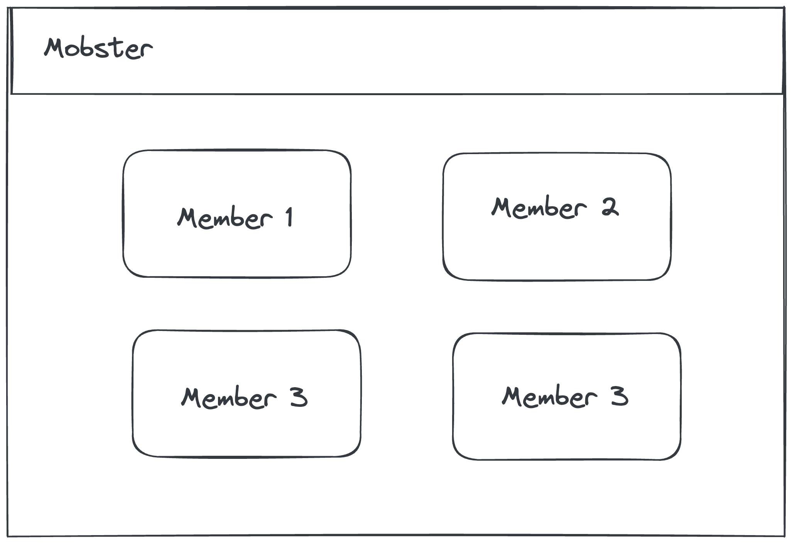

# jsfs-lab-mobster

In today's lab, you're going to work on a real-world application that will fly out in the world for others to see. You're going to work with a frontend and a backend app separately so you can deploy them and they can work with each other.

## Tasks

### Create & Deploy the Frontend App
Create a [ViteJS](https://vitejs.dev/guide/) Vanilla TypeScript app using the TypeScript template. Once done, commit and push the project to a GitHub repository as it is. You can use one of the mob's member's GitHub account to do it. Once the code has been pushed, deploy the app to the GitHub pages using the [`gh-pages`](https://www.npmjs.com/package/gh-pages) package.
Make sure the frontend app works and you're able to see the output. 

### Create & Deploy the Backend App
For the backend, you will create a basic ExpressJS app using the [Express Generator]((https://expressjs.com/en/starter/generator.html)). Without coding any further logic, push your code to a newly created GitHub repository. You can use one of the mob's member's GitHub account to do it. You will now deploy the app to the [Railway.app](https://railway.app/) platform via linking your GitHub project.
If railway doesn't work, you can look into [Vercel](https://vercel.com/guides/using-express-with-vercel) to deploy your project or any other hosting provider.

### Implement the Mobs Routes

In your backend app, create a new set of routes against the `mobs` URL and implement the CRUD routes for them. Check that your API routes work using Postman or Insomnia. A new mob should take the following body as input:
```json
{
  "name" : "MOB_NAME"
}
```
A unique ID for each mob should be generated.

### Implement the Members Routes

Create another set of routes against the `members` URL. Implement CRUD operatios for this as well. A new member should be created using the following body:

A new mob should take the following body as input:
```json
{
  "name" : "MEMBER_NAME",
  "mobId": "MOB_ID"
}
```

A unique ID for each member should be generated.

### Implement route to get members of a specific mob

This is what your frontend will request using the mob ID. It should be able to get all the members of a mob from the server.

### Frontend

Your frontend should show a bunch of cards showing the mob name and the mob members as follows. This is the minimum requirement:

  <!-- {style="width:800px;padding:10px;" class="plain fade-in"} -->

 Feel free to improvise the design and the information a member could have. Think about adding their github/linkedin links etc. 
 
#### Hint: Example routes:
You can see the following routes to get an idea about how your routes should look like:
```bash
`GET YOUR_BACKEND_URL/mobs/` # get all mobs
`POST YOUR_BACKEND_URL/mobs/` # add a new mob
`GET YOUR_BACKEND_URL/mobs/:mobId` # get a particular mob
`GET YOUR_BACKEND_URL/mobs/:mobId/members` # get all mob members of a particular mob
`POST YOUR_BACKEND_URL/mobs/:mobId/members` # add a new mob-member to the mob
`GET YOUR_BACKEND_URL/mobs/:mobId/members/:memberId` # get a particular mob-member of a particular mob
```


### Final Deployment

Once the code for both frontend and backend is finalized, push to your github and deploy the end results.

### Lint

Please add linting to both the (frontend and backend) projects and add the script `lint` to `package.json` for it to run. This makes sure you have a consistent coding style across developers/contributors of the project.

## Beautify Readme

Add the names, github links, and linkedin links of all your mob members in the Readme of both projects. You can use [this template](https://github.com/othneildrew/Best-README-Template) for it.

Good Luck! 
